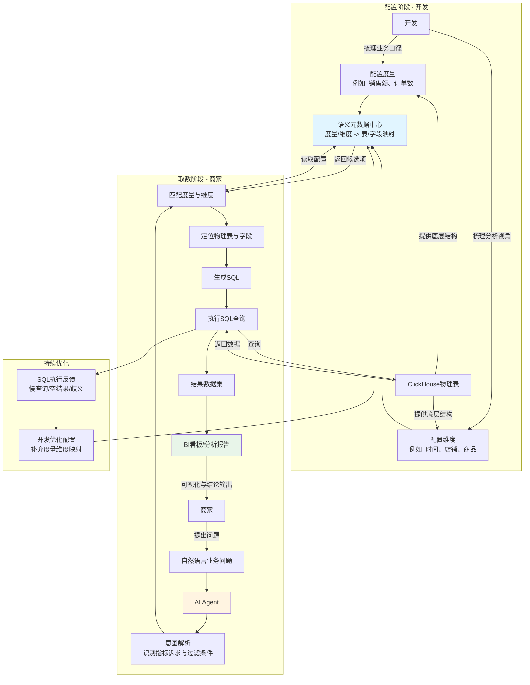

# AI取数系统业务流程图（v1）

## 流程图

```mermaid
flowchart TD
    subgraph DevStage[配置阶段 - 开发]
        D1[开发]
        CH[ClickHouse物理表]
        MDef[配置度量<br/>例如: 销售额、订单数]
        DDef[配置维度<br/>例如: 时间、店铺、商品]
        Meta[语义元数据中心<br/>度量/维度 -> 表/字段映射]

        D1 -->|梳理业务口径| MDef
        D1 -->|梳理分析视角| DDef
        CH -->|提供底层结构| MDef
        CH -->|提供底层结构| DDef
        MDef --> Meta
        DDef --> Meta
    end

    subgraph QueryStage[取数阶段 - 商家]
        U1[商家]
        Q[自然语言业务问题]
        Agent[AI Agent]
        Parse[意图解析<br/>识别指标诉求与过滤条件]
        Match[匹配度量与维度]
        Locate[定位物理表与字段]
        SQL[生成SQL]
        Exec[执行SQL查询]
        Data[结果数据集]
        BI[BI看板/分析报告]

        U1 -->|提出问题| Q
        Q --> Agent
        Agent --> Parse
        Parse --> Match
        Match -->|读取配置| Meta
        Meta -->|返回候选项| Match
        Match --> Locate
        Locate --> SQL
        SQL --> Exec
        Exec -->|查询| CH
        CH -->|返回数据| Exec
        Exec --> Data
        Data --> BI
        BI -->|可视化与结论输出| U1
    end

    subgraph Feedback[持续优化]
        F1[SQL执行反馈<br/>慢查询/空结果/歧义]
        F2[开发优化配置<br/>补充度量维度映射]
    end

    Exec --> F1
    F1 --> F2
    F2 --> Meta

    style Meta fill:#e1f5ff
    style Agent fill:#fff4e1
    style BI fill:#e8f5e9
```

## 关键说明

- 开发只维护**度量**与**维度**，不预定义固定指标组合，提升灵活性。
- Agent 根据商家问题动态组合聚合函数、过滤条件与计算逻辑，实时生成 SQL。
- 通过语义映射层把业务表达（度量/维度）和技术实现（物理表/字段）解耦。
- 结果既可输出为可视化 BI 看板，也可生成结构化业务分析报告。
