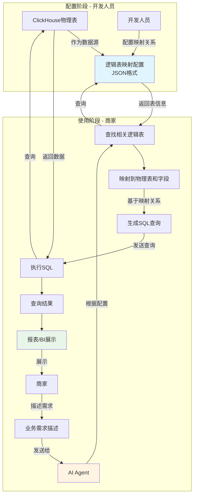

# AI取数系统业务流程图

## 流程图

## 关键节点说明

### 1. 配置阶段（开发人员）
- **ClickHouse物理表**：实际存储数据的数据库表
- **逻辑表映射配置**：开发人员创建的JSON配置文件，定义逻辑表与物理表的映射关系
- **配置内容**：表名映射、字段映射、业务含义描述等

### 2. 使用阶段（商家）
- **业务需求描述**：商家用自然语言描述取数需求（如："查询最近7天的销售额"）
- **AI Agent**：智能分析需求，识别相关逻辑表和字段
- **查找逻辑表**：根据需求在配置中查找相关的逻辑表
- **映射到物理表**：将逻辑表和字段转换为实际的ClickHouse表和字段
- **生成SQL**：基于映射关系生成可执行的SQL查询语句
- **执行SQL**：在ClickHouse中执行查询
- **生成报表**：将查询结果可视化展示

## 数据流转

1. **配置流**：ClickHouse表 → 开发配置 → JSON配置文件
2. **查询流**：商家需求 → AI分析 → 查配置 → 生成SQL → 执行查询 → 展示结果

## 关键特性

- **双向映射**：逻辑表（业务视角）↔ 物理表（技术视角）
- **自然语言交互**：商家无需了解SQL，用业务语言描述需求
- **智能匹配**：AI Agent自动识别需求对应的表和字段
- **灵活配置**：开发人员通过JSON配置即可维护映射关系
