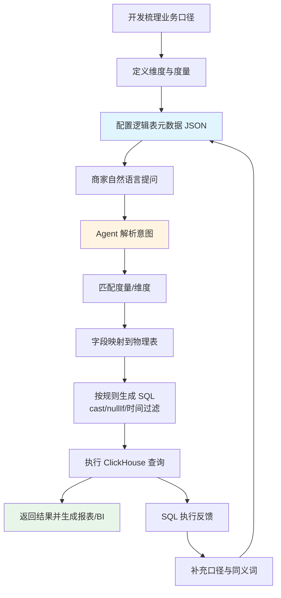

# 零售销售核算数据表落地方案（v1）

## 0. 流程图（v1 语义建模到 SQL）



## 1. 逻辑表定位

- 逻辑表 ID: `retail_sales_hourly_fact`
- 表角色: 零售销售核算核心事实宽表（小时粒度）
- 默认时间维度: `natural_day`
- 建议主分析粒度: `natural_day + hourly + kdt_id`
- 必要租户过滤: `kdt_id` / `hq_kdt_id`

## 2. 维度配置（开发侧）

按语义分组配置到元数据中心，供 Agent 做自然语言匹配：

- 时间维度：`natural_day`、`natural_day_v2`、`hourly`、`cross_day_date`、`natural_weekly`、`natural_monthly`、`natural_quarterly`
- 组织维度：`hq_kdt_id`、`kdt_id`
- 订单维度：`bill_no`、`order_no`、`finance_order_src_code`、`join_type`、`no_original_refund_type`
- 物流维度：`fin_logistics_type_id`、`self_fetch_id`
- 地理维度：`team_province_id`、`team_city_id`、`team_district_id`
- 用户/会员维度：`buyer_id`、`is_memb_order`、`is_new_payment_customer_order`、`is_free_memb_level`、`is_paid_memb_level`

## 3. 度量配置（开发侧）

先定义原子度量，不预先定义固定指标组合：

- 交易规模：`total_amt`、`paid_order_amt`、`paid_order_origin_amt`
- 订单计数：`placed_order_cnt`、`paid_order_cnt`
- 退款：`exclude_cashback_refunded_order_cnt`、`exclude_cashback_refunded_order_amt`
- 商品：`paid_order_sku_cnt`、`paid_order_sku_amt`、`exclude_cashback_refunded_order_sku_cnt`、`exclude_cashback_refunded_order_sku_amt`
- 费用：`order_postage`、`refund_postage`、`package_fee_amt`、`refund_package_fee_amt`、`service_fee_amt`、`refund_service_fee_amt`、`paid_order_platform_service_fee`
- 储值/礼卡：`top_up_cnt`、`top_up_amt`、`top_up_refund_cnt`、`top_up_refund_amt`、`gift_card_order_paid_amt`、`gift_card_order_refunded_amt`
- 人数：`paid_order_uv`、`top_up_uv`、`refunded_order_uv`

## 4. 字段类型与 SQL 生成规则

### 4.1 计数字段转型（重点）

以下字段为 `varchar`，生成 SQL 时必须显式转换：

- `placed_order_cnt`
- `paid_order_cnt`
- `exclude_cashback_refunded_order_cnt`
- `top_up_cnt`
- `top_up_refund_cnt`

推荐规则（ClickHouse）：

- 计数求和：`sum(toInt64OrZero(field))`
- 金额求和：`sum(toDecimal64OrZero(field, 4))`（仅在上游可能脏数据时启用）
- 比率计算分母保护：`/ nullIf(denominator, 0)`

### 4.2 时间规则

- 默认按 `natural_day` 过滤时间范围
- 若问题包含“按小时”，自动追加维度 `hourly`
- 若问题包含“周/月/季度”，优先使用 `natural_weekly` / `natural_monthly` / `natural_quarterly`

## 5. 推荐的衍生指标（由 Agent 动态计算）

- 客单价：`sum(paid_order_amt) / nullIf(sum(toInt64OrZero(paid_order_cnt)), 0)`
- 退款率：`sum(exclude_cashback_refunded_order_amt) / nullIf(sum(paid_order_amt), 0)`
- 件单价：`sum(paid_order_sku_amt) / nullIf(sum(paid_order_sku_cnt), 0)`
- 储值净额：`sum(top_up_amt) - sum(top_up_refund_amt)`

## 6. 元数据配置样例（可直接改造为 JSON）

```json
{
  "table_id": "10",
  "physical_table": "dm_retail.retail_sales_detail_team_src_fin_logistics",
  "default_time_dimension": "natural_day",
  "tenant_filters": ["kdt_id", "hq_kdt_id"],
  "dimensions": [
    {"id": "natural_day", "column": "natural_day", "type": "date", "synonyms": ["日期", "天", "自然日"]},
    {"id": "hourly", "column": "hourly", "type": "int", "synonyms": ["小时", "时段"]},
    {"id": "kdt_id", "column": "kdt_id", "type": "int", "synonyms": ["店铺", "门店"]},
    {"id": "fin_logistics_type_id", "column": "fin_logistics_type_id", "type": "int", "synonyms": ["物流类型"]},
    {"id": "team_city_id", "column": "team_city_id", "type": "string", "synonyms": ["城市"]}
  ],
  "measures": [
    {"id": "gmv", "column": "total_amt", "agg": "sum", "data_type": "decimal", "synonyms": ["营业额", "GMV"]},
    {"id": "paid_order_amt", "column": "paid_order_amt", "agg": "sum", "data_type": "decimal", "synonyms": ["支付金额"]},
    {"id": "paid_order_cnt", "column": "paid_order_cnt", "agg": "sum", "cast": "toInt64OrZero", "data_type": "int", "synonyms": ["支付订单数"]},
    {"id": "refund_amt", "column": "exclude_cashback_refunded_order_amt", "agg": "sum", "data_type": "decimal", "synonyms": ["退款金额"]}
  ],
  "computed_metrics": [
    {
      "id": "avg_order_price",
      "expr": "sum(paid_order_amt) / nullIf(sum(toInt64OrZero(paid_order_cnt)), 0)",
      "synonyms": ["客单价"]
    }
  ]
}
```

## 7. 上线前验证清单

- 问法一：最近 7 天各店铺营业额和支付订单数
- 问法二：昨天按小时看支付金额趋势
- 问法三：本月按物流类型看退款率

要求全部通过：意图解析 -> 度量维度匹配 -> 字段定位 -> SQL 生成 -> 数据可视化输出。

## 8. 案例（v1 语义建模型）

### 8.1 给大模型系统提示词中的表配置（示例）

```json
{
  "table_id": "10",
  "physical_table": "dm_retail.retail_sales_detail_team_src_fin_logistics",
  "default_time_dimension": "natural_day",
  "tenant_filters": ["kdt_id", "hq_kdt_id"],
  "dimensions": [
    {"id": "natural_day", "column": "natural_day", "synonyms": ["日期", "天", "自然日"]},
    {"id": "kdt_id", "column": "kdt_id", "synonyms": ["店铺", "门店"]},
    {"id": "hourly", "column": "hourly", "synonyms": ["小时", "时段"]}
  ],
  "measures": [
    {"id": "gmv", "column": "total_amt", "agg": "sum", "synonyms": ["营业额", "GMV", "销售额"]},
    {"id": "paid_order_cnt", "column": "paid_order_cnt", "agg": "sum", "cast": "toInt64OrZero", "synonyms": ["支付订单数", "支付单量"]}
  ],
  "computed_metrics": [
    {"id": "avg_order_price", "expr": "sum(paid_order_amt)/nullIf(sum(toInt64OrZero(paid_order_cnt)),0)", "synonyms": ["客单价"]}
  ]
}
```

### 8.2 简单测试提示词（可直接喂给 SQL Agent）

```text
你是 ClickHouse SQL 生成助手。根据给定的逻辑表配置生成 SQL。
要求：
1) 仅输出 SQL，不要解释；
2) 必须使用配置中的字段和聚合规则；
3) paid_order_cnt 需要使用 toInt64OrZero 转型后再 sum；
4) 时间过滤默认使用 natural_day；
5) 限定租户 kdt_id = 1001。
```

### 8.3 测试问题

最近7天按天查看店铺1001的营业额和支付订单数。

### 8.4 预期 SQL（用于验收）

```sql
SELECT
  natural_day,
  sum(total_amt) AS gmv,
  sum(toInt64OrZero(paid_order_cnt)) AS paid_order_cnt
FROM dm_retail.retail_sales_detail_team_src_fin_logistics
WHERE kdt_id = 1001
  AND natural_day >= formatDateTime(dateSub(day, 6, today()), '%Y-%m-%d')
  AND natural_day <= formatDateTime(today(), '%Y-%m-%d')
GROUP BY natural_day
ORDER BY natural_day;
```
