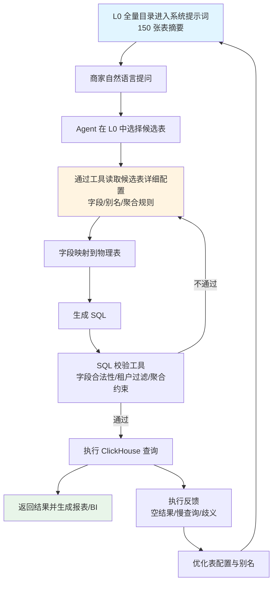

# 零售销售核算数据表落地方案（v2）

## 0. 流程图（v2 逻辑表映射执行）



## 1. 目标与定位

按照 `AI取数业务流程图-v2`，该表的核心落地点是：

- 将物理表映射为 1 份可检索、可解释、可生成 SQL 的逻辑表 JSON
- 让 Agent 通过“查逻辑表 -> 字段映射 -> SQL 生成”完成取数

建议逻辑表 ID：`retail.sales_hourly_detail`

## 2. 逻辑表注册（FindTable 阶段）

在配置中心新增逻辑表元信息：

- `table_id`: `retail.sales_hourly_detail`
- `physical_table`: `db.零售销售核算数据店铺渠道物流类型小时维度明细表`（替换为真实库表）
- `business_desc`: 店铺/渠道/物流/小时粒度零售销售核算事实表
- `time_column_default`: `natural_day`
- `tenant_columns`: `kdt_id`, `hq_kdt_id`
- `search_tags`: `销售`, `营业额`, `支付`, `退款`, `物流`, `小时`, `店铺`

## 3. 字段语义映射（Mapping 阶段）

为高频字段补齐别名，提升自然语言召回率：

- `total_amt`: 营业额、GMV、销售额
- `paid_order_amt`: 支付金额、实付金额
- `paid_order_cnt`: 支付订单数、支付单量
- `exclude_cashback_refunded_order_amt`: 退款金额
- `fin_logistics_type_id`: 物流类型
- `hourly`: 小时、时段
- `kdt_id`: 店铺、门店

## 4. 聚合规则（GenSQL 阶段）

### 4.1 强制转型字段

以下 `varchar` 字段在 SQL 里必须转型后聚合：

- `placed_order_cnt`
- `paid_order_cnt`
- `exclude_cashback_refunded_order_cnt`
- `top_up_cnt`
- `top_up_refund_cnt`

推荐表达式：

- `sum(toInt64OrZero(field))`

### 4.2 通用计算规则

- 金额求和：`sum(field)`（脏数据风险高时使用 `toDecimal64OrZero(field, 4)`）
- 比率类：`numerator / nullIf(denominator, 0)`
- 时间默认过滤字段：`natural_day`

## 5. 指标语义约束（避免错误 SQL）

建议在逻辑表 JSON 中增加 `aggregation_semantics`：

- 可直接加总：`total_amt`、`paid_order_amt`、退款金额类、费用类、件数类
- 谨慎加总（可能跨粒度重复）：`paid_order_uv`、`top_up_uv`、`refunded_order_uv`

## 6. 可执行 JSON 示例（v2 风格）

```json
{
  "table_id": "retail.sales_hourly_detail",
  "physical_table": "db.零售销售核算数据店铺渠道物流类型小时维度明细表",
  "business_desc": "店铺/渠道/物流/小时粒度零售销售核算事实表",
  "time_column_default": "natural_day",
  "tenant_columns": ["kdt_id", "hq_kdt_id"],
  "search_tags": ["销售", "营业额", "支付", "退款", "物流", "小时", "店铺"],
  "dimensions": [
    {"column": "natural_day", "aliases": ["日期", "天", "自然日"]},
    {"column": "hourly", "aliases": ["小时", "时段"]},
    {"column": "kdt_id", "aliases": ["店铺", "门店"]},
    {"column": "fin_logistics_type_id", "aliases": ["物流类型"]}
  ],
  "measures": [
    {"column": "total_amt", "agg": "sum", "aliases": ["营业额", "GMV", "销售额"]},
    {"column": "paid_order_amt", "agg": "sum", "aliases": ["支付金额", "实付金额"]},
    {"column": "paid_order_cnt", "agg": "sum", "cast": "toInt64OrZero", "aliases": ["支付订单数", "支付单量"]},
    {"column": "exclude_cashback_refunded_order_amt", "agg": "sum", "aliases": ["退款金额"]}
  ],
  "derived_metrics": [
    {
      "name": "refund_rate",
      "expr": "sum(exclude_cashback_refunded_order_amt) / nullIf(sum(paid_order_amt), 0)",
      "aliases": ["退款率"]
    }
  ],
  "aggregation_semantics": {
    "safe_additive": ["total_amt", "paid_order_amt", "exclude_cashback_refunded_order_amt"],
    "non_additive_or_careful": ["paid_order_uv", "top_up_uv", "refunded_order_uv"]
  }
}
```

## 7. 验收样例（端到端）

- 最近 7 天各店铺营业额和支付订单数
  - 维度：`natural_day`, `kdt_id`
  - 度量：`sum(total_amt)`, `sum(toInt64OrZero(paid_order_cnt))`
- 昨天按小时看支付金额趋势
  - 维度：`hourly`
  - 度量：`sum(paid_order_amt)`
  - 过滤：`natural_day = yesterday()`
- 本月按物流类型看退款率
  - 维度：`fin_logistics_type_id`
  - 指标：`sum(exclude_cashback_refunded_order_amt) / nullIf(sum(paid_order_amt), 0)`

## 8. 案例（v2 映射执行链路）

### 8.1 给大模型系统提示词中的表配置（示例）

```json
{
  "table_id": "retail.sales_hourly_detail",
  "physical_table": "dm_retail.retail_sales_detail_team_src_fin_logistics",
  "business_desc": "店铺/渠道/物流/小时粒度零售销售核算事实表",
  "time_column_default": "natural_day",
  "tenant_columns": ["kdt_id", "hq_kdt_id"],
  "search_tags": ["销售", "营业额", "支付", "退款", "物流", "小时", "店铺"],
  "dimensions": [
    {"column": "natural_day", "aliases": ["日期", "天", "自然日"]},
    {"column": "fin_logistics_type_id", "aliases": ["物流类型"]},
    {"column": "kdt_id", "aliases": ["店铺", "门店"]}
  ],
  "measures": [
    {"column": "paid_order_amt", "agg": "sum", "aliases": ["支付金额", "实付金额"]},
    {"column": "exclude_cashback_refunded_order_amt", "agg": "sum", "aliases": ["退款金额"]}
  ],
  "derived_metrics": [
    {
      "name": "refund_rate",
      "expr": "sum(exclude_cashback_refunded_order_amt) / nullIf(sum(paid_order_amt), 0)",
      "aliases": ["退款率"]
    }
  ]
}
```

### 8.2 简单测试提示词（可直接喂给 SQL Agent）

```text
你是 SQL 生成助手。先根据 query 在 search_tags 和 aliases 中匹配逻辑表与字段，再生成 ClickHouse SQL。
输出约束：
1) 只输出 SQL；
2) 只能使用命中的 physical_table 与字段；
3) 比率指标必须使用预定义 derived_metrics 表达式；
4) 默认时间字段使用 natural_day；
5) 限定租户 hq_kdt_id = 2001。
```

### 8.3 测试问题

统计本月总部店铺2001按物流类型的退款率，并按退款率降序。

### 8.4 预期 SQL（用于验收）

```sql
SELECT
  fin_logistics_type_id,
  sum(exclude_cashback_refunded_order_amt) / nullIf(sum(paid_order_amt), 0) AS refund_rate
FROM dm_retail.retail_sales_detail_team_src_fin_logistics
WHERE hq_kdt_id = 2001
  AND toDate(natural_day) >= toStartOfMonth(today())
  AND toDate(natural_day) <= today()
GROUP BY fin_logistics_type_id
ORDER BY refund_rate DESC;
```
